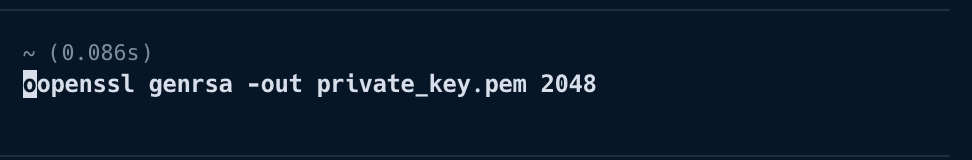
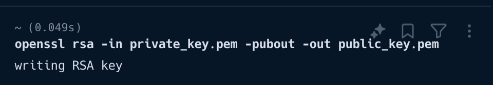
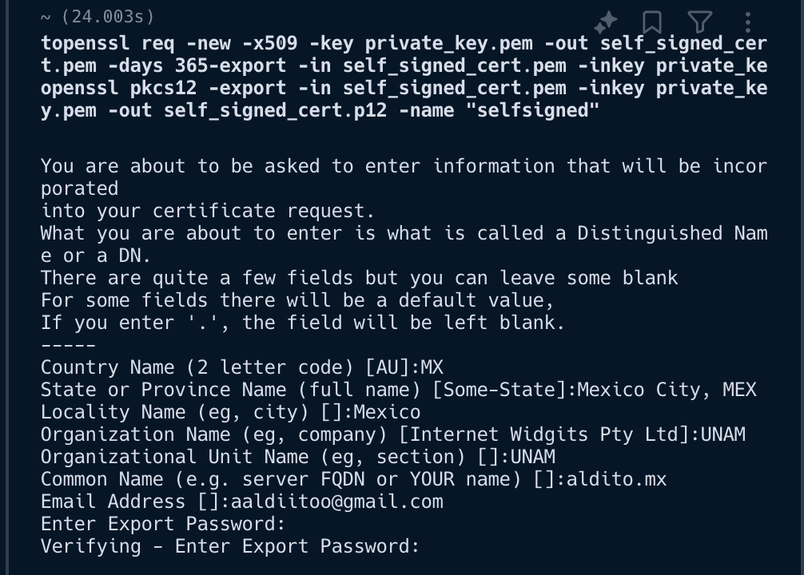
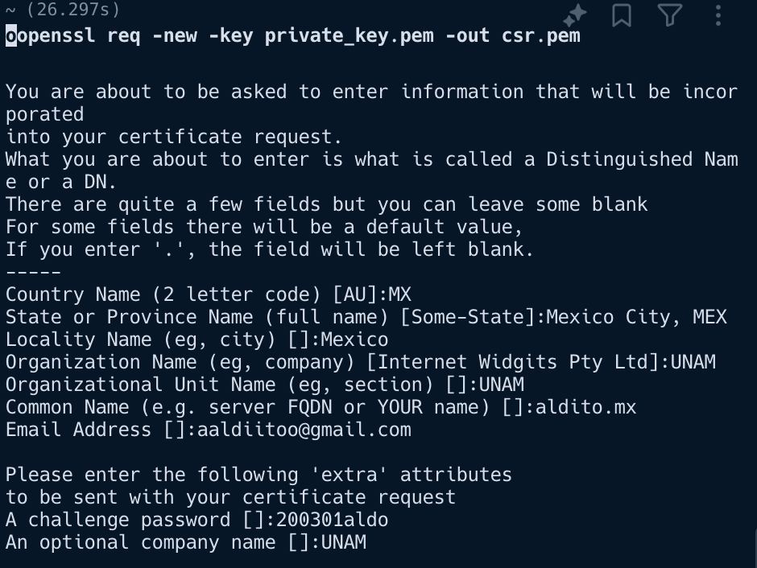
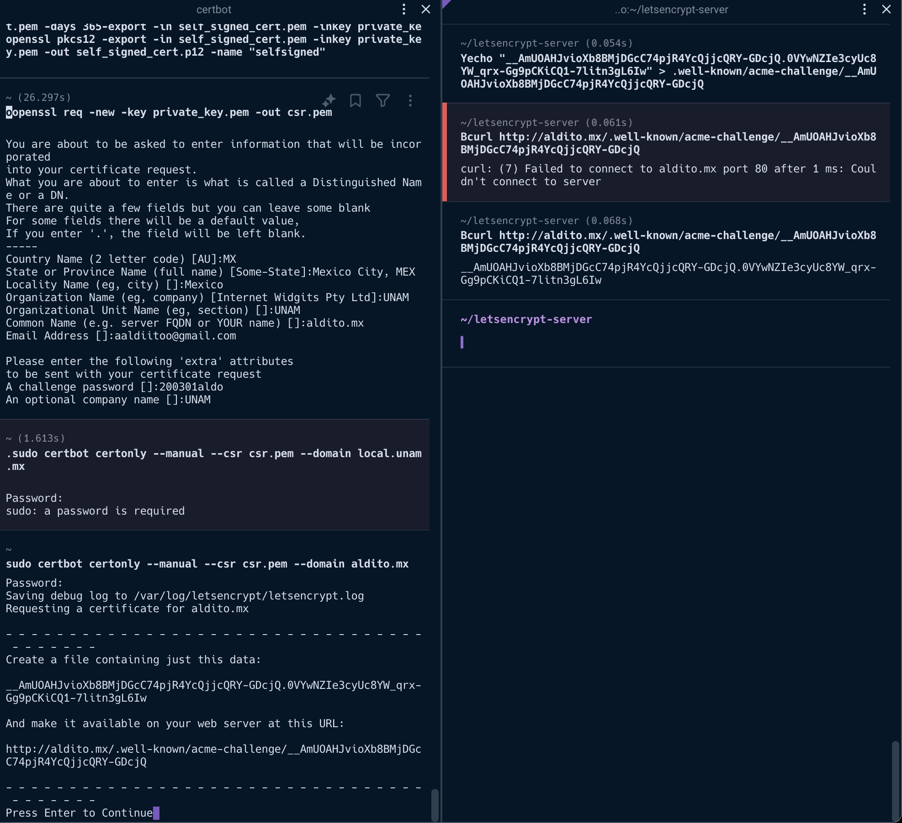

# Cover Page

| **Name**          | Aldo Navarrete |
|-------------------|----------------|
| **Course**        | Let's Encrypt Server |
| **Assignment**    | OpenSSL Command Line Utilities |
| **Date**          | 9-11-24 |
| **Instructor**    | Rocío Aldeco Perez|

# Resources
- [OpenSSL Command Line Utilities](https://wiki.openssl.org/index.php/Command_Line_Utilities)
- [Let’s Encrypt](https://letsencrypt.org/)
- [Getacert](https://getacert.com/)

# Report

## Task 1: Generate an RSA Private Key
**Command Used:** `openssl genpkey -algorithm RSA -out private_key.pem -pkeyopt rsa_keygen_bits:2048`

**Screenshot:** 

**Explanation:** This command generates a 2048-bit RSA private key and saves it to `private_key.pem`.

## Task 2: Generate an RSA Public Key
**Command Used:** `openssl rsa -pubout -in private_key.pem -out public_key.pem`

**Screenshot:** 

**Explanation:** This command extracts the public key from the private key and saves it to `public_key.pem`.

## Task 3: Create a Self-Signed Certificate
**Command Used:** `openssl req -new -x509 -key private_key.pem -out self_signed_cert.pem -days 365`

**Screenshot:** 

**Explanation:** This command creates a self-signed certificate valid for 365 days using the private key.

## Task 4: Create a Certificate Signed by an Authority
**Commands Used:**
1. `openssl req -new -key private_key.pem -out csr.pem`
2. `certbot certonly --standalone -d yourdomain.com --csr csr.pem`

**Screenshot:** 

**Explanation:** The first command generates a CSR, and the second command uses Let's Encrypt to sign the certificate.

## Task 5: Verify the Certificate
**Command Used:** `openssl verify -CAfile path/to/ca_cert.pem -untrusted intermediate.pem yourdomain.com.pem`

**Screenshot:** 

**Explanation:** This command verifies the certificate against the CA certificate and intermediate certificate.

# Conclusions

Through this exercise, I learned how to use OpenSSL command line utilities to generate RSA keys, create self-signed certificates, and obtain certificates signed by an authority. The process of generating and verifying certificates is crucial for ensuring secure communications over the internet. Using Let's Encrypt provides a free and automated way to obtain trusted certificates, which is beneficial for small projects and organizations.

I had the problem in the step 5, I couldn't create a host or domain to verify the certificate, so I couldn't complete the task. I will try to solve this problem in the future.
